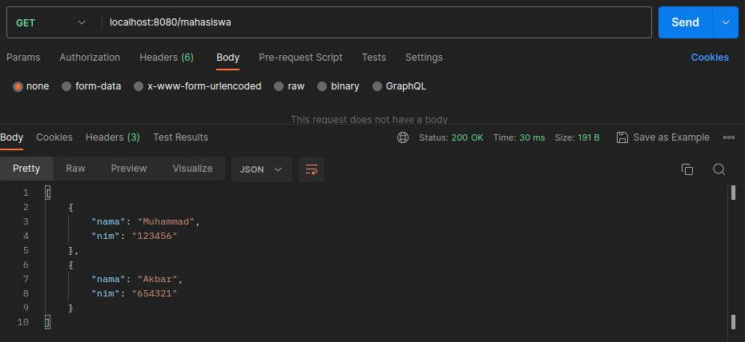

## Install Go, MongoDb dan MySql


## Program Go MySQL
```
Mohon maaf disini dbms MySQL saya sedikit bermasalah di MX linux, sebagai alternatif saya menggantinya dengan PostgreSQL
```

```
package main

import (
	"database/sql"
	"fmt"
	"log"

	_ "github.com/lib/pq"
)

func main() {
	db, err := sql.Open("postgres", "user=akbar password=01111997 dbname=latihan sslmode=disable")
	if err != nil {
		log.Fatal(err)
	}
	defer db.Close()

	err = db.Ping()
	if err != nil {
		log.Fatal(err)
	}

	rows, err := db.Query("SELECT nim, nama FROM mahasiswa")
	if err != nil {
		log.Fatal(err)
	}
	defer rows.Close()

	for rows.Next() {
		var nim string
		var nama string
		if err := rows.Scan(&nim, &nama); err != nil {
			log.Fatal(err)
		}
		fmt.Printf("NIM: %s, Nama: %s\n", nim, nama)
	}

	if err := rows.Err(); err != nil {
		log.Fatal(err)
	}
}
```
### Output


## Program Go MongoDB

```
package main

import (
	"context"
	"fmt"
	"log"

	"go.mongodb.org/mongo-driver/bson"
	"go.mongodb.org/mongo-driver/mongo"
	"go.mongodb.org/mongo-driver/mongo/options"
)

func main() {
	clientOptions := options.Client().ApplyURI("mongodb://localhost:27017")
	client, err := mongo.Connect(context.TODO(), clientOptions)
	if err != nil {
		log.Fatal(err)
	}
	defer client.Disconnect(context.TODO())

	collection := client.Database("latihan").Collection("mahasiswa")

	filter := bson.D{}

	cursor, err := collection.Find(context.TODO(), filter)
	if err != nil {
		log.Fatal(err)
	}
	defer cursor.Close(context.TODO())

	for cursor.Next(context.TODO()) {
		var result bson.M
		err := cursor.Decode(&result)
		if err != nil {
			log.Fatal(err)
		}
		fmt.Println(result)
	}

	if err := cursor.Err(); err != nil {
		log.Fatal(err)
	}
}
```

### Output


## Program Go Gin MySQL
```
package main

import (
	"database/sql"
	"log"

	"github.com/gin-gonic/gin"
	_ "github.com/lib/pq"
)

func main() {
	r := gin.Default()

	db, err := sql.Open("postgres", "user=akbar password=01111997 dbname=latihan sslmode=disable")
	if err != nil {
		log.Fatal(err)
	}
	defer db.Close()

	r.GET("/mahasiswa", func(c *gin.Context) {
		rows, err := db.Query("SELECT nim, nama FROM mahasiswa")
		if err != nil {
			c.JSON(500, gin.H{"error": err.Error()})
			return
		}
		defer rows.Close()

		var results []gin.H
		for rows.Next() {
			var nim string
			var nama string
			if err := rows.Scan(&nim, &nama); err != nil {
				c.JSON(500, gin.H{"error": err.Error()})
				return
			}
			results = append(results, gin.H{"nim": nim, "nama": nama})
		}

		c.JSON(200, results)
	})

	r.Run(":8080")
}
```
### Output


## Program Go Gin MongoDB

```
package main

import (
	"context"
	"log"

	"github.com/gin-gonic/gin"
	"go.mongodb.org/mongo-driver/bson"
	"go.mongodb.org/mongo-driver/bson/primitive"
	"go.mongodb.org/mongo-driver/mongo"
	"go.mongodb.org/mongo-driver/mongo/options"
)

func main() {
	r := gin.Default()

	clientOptions := options.Client().ApplyURI("mongodb://localhost:27017")
	client, err := mongo.Connect(context.TODO(), clientOptions)
	if err != nil {
		log.Fatal(err)
	}
	defer client.Disconnect(context.TODO())

	collection := client.Database("latihan").Collection("mahasiswa")

	r.GET("/mahasiswa", func(c *gin.Context) {
		filter := bson.D{}
		cursor, err := collection.Find(context.TODO(), filter)
		if err != nil {
			c.JSON(500, gin.H{"error": err.Error()})
			return
		}
		defer cursor.Close(context.TODO())

		var results []gin.H
		for cursor.Next(context.TODO()) {
			var result primitive.M
			err := cursor.Decode(&result)
			if err != nil {
				c.JSON(500, gin.H{"error": err.Error()})
				return
			}
			results = append(results, gin.H(result))
		}

		c.JSON(200, results)
	})

	r.Run(":8080")
}
```
### Output

