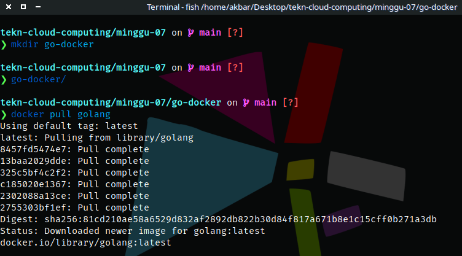
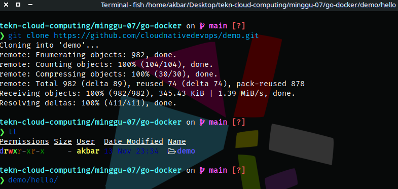
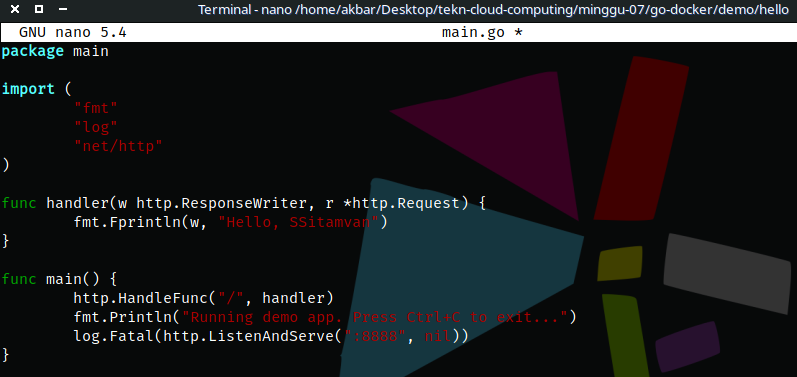
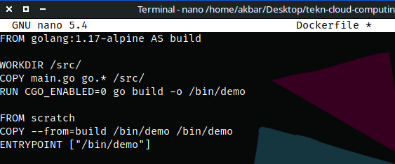
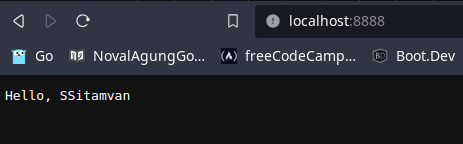

# Tugas
## DockerHub Image

1. Membuat direktori baru dengan nama file go-docker lalu pull image golang 

2. Clone docker image seperti gambar dibawah 

3. Membuat file dengan format main.go 

4. Membuat file dengan nama DockerFile 

5. Jalankan dan buka link URL [localhost:8888] pada browser 

