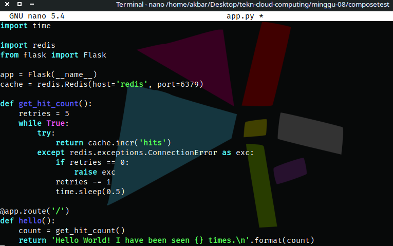

# Docker Compose

## Step 1: Define the application dependencies

1. Create a directory for the project
<div align="center"></div>

2. Create a file called app.py in your project directory and add this code
<div align="center"></div>

3. Create another file called requirements.txt in your project directory and add this code
<div align="center"></div>

## Step 2: Create a Dockerfile

1. In your project directory, create a file named Dockerfile and add this code
<div align="center"></div>

## Step 3: Define services in a Compose file

1. Create a file called compose.yaml in your project directory and this code 
<div align="center"></div>

## Step 4: Build and run your app with Compose

1. From your project directory, start up your application by running docker compose up
<div align="center"></div>


2. Enter http://localhost:8000/ in a browser to see the application running.
<div align="center"></div>

3. Refresh the page, The number should increment. 
<div align="center"></div>

4. Switch to another terminal window, and type docker image ls to list local images. Listing images at this point should return redis and web. 
<div align="center"></div>

5. Stop the application, either by running docker compose down from within your project directory in the second terminal, or by hitting CTRL+C in the original terminal where you started the app. 

## Step 5: Edit the Compose file to add a bind mount

1. Edit the compose.yaml file in your project directory to add a bind mount for the web service:
<div align="center"></div>

## Step 6: Re-build and run the app with Compose

1. From your project directory, type docker compose up to build the app with the updated Compose file, and run it.
<div align="center"></div>

2. Check the Hello World message in a web browser again, and refresh to see the count increment.

## Step 7: Update the application
1. Change the greeting in app.py and save it. For example, change the Hello World! message to Hello from Docker!:
<div align="center"></div>

2. Refresh the app in your browser. The greeting should be updated, and the counter should still be incrementing.
<div align="center"></div>

## Step 8: Experiment with some other commands
1. If you want to run your services in the background, you can pass the -d flag (for "detached" mode) to docker compose up and use docker compose ps to see what is currently running:
<div align="center"></div>

2. The docker compose run command allows you to run one-off commands for your services. For example, to see what environment variables are available to the web service:
```
 docker compose run web env
```
3. If you started Compose with docker compose up -d, stop your services once you've finished with them:
```
docker compose stop
```
4. You can bring everything down, removing the containers entirely, with the down command. Pass --volumes to also remove the data volume used by the Redis container:
5. ```
   docker compose down --volumes
   ```
