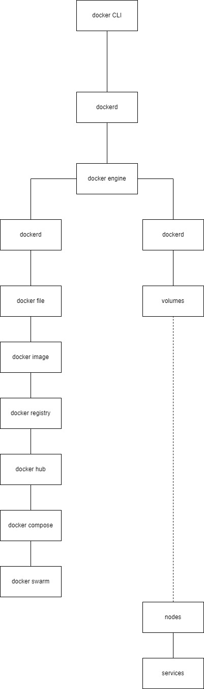

## Diagram 

- Docker CLI adalah antarmuka baris perintah yang digunakan oleh pengguna untuk berinteraksi dengan Docker.

- dockerd adalah daemon Docker yang berjalan di latar belakang pada sistem host dan bertanggung jawab untuk menjalankan perintah Docker yang diberikan melalui Docker CLI.

- Docker Engine adalah kombinasi dari Docker CLI dan dockerd. Ini adalah komponen utama yang menghubungkan antara pengguna (melalui CLI) dan lingkungan Docker (melalui dockerd).

- Docker Image adalah template baca-saja yang berisi semua yang diperlukan untuk menjalankan aplikasi, termasuk kode, runtime, dependensi, dan konfigurasi.

- Docker Container adalah sebuah instansi yang berjalan dari Docker Image. Container adalah unit yang dapat dijalankan secara independen dan terisolasi, yang menjalankan aplikasi atau layanan tertentu.

- Dockerfile adalah file teks yang berisi instruksi untuk membangun Docker Image.

- Volumes adalah mekanisme Docker untuk menyimpan data di luar container, sehingga data tersebut dapat tetap persisten dan tersedia bahkan setelah container dihapus.

- Docker Registry adalah tempat penyimpanan yang digunakan untuk menyimpan Docker Image. Docker Hub adalah salah satu contoh Docker Registry publik yang umum digunakan.

- Docker Compose adalah alat yang memungkinkan pengguna untuk mendefinisikan dan menjalankan aplikasi multi-container menggunakan file konfigurasi YAML.

- Docker Swarm adalah alat orkestrasi bawaan yang memungkinkan pengguna untuk mengelola dan menjalankan aplikasi dalam
