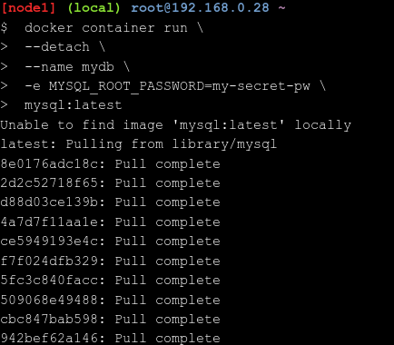

## Clone the Lab’s GitHub Repo
1. git clone https://github.com/dockersamples/linux_tweet_app

<div align="center"></div>

## Run a single task in an Alpine Linux container
1. docker container run alpine hostname
2. docker container ls --all

<div align="center"></div>
<div align="center"></div>


## Run an interactive Ubuntu container
1. docker container run --interactive --tty --rm ubuntu bash
2. ls /
3. ps aux
4. cat /etc/issue
5. exit
6. cat /etc/issue

<div align="center"></div>
<div align="center"></div>
<div align="center"></div>

## Run a background MySQL container
1. masukkan perintah ini pada CLI
```sh
docker container run \
 --detach \
 --name mydb \
 -e MYSQL_ROOT_PASSWORD=my-secret-pw \
 mysql:latest
```
2. docker container ls
3. docker container logs mydb
4.  docker container top mydb
5. docker exec -it mydb \
 mysql --user=root --password=$MYSQL_ROOT_PASSWORD --version

<div align="center"></div>
<div align="center"></div>
<div align="center"></div>
<div align="center"></div>
<div align="center"></div>

## Build a simple website image
1.  cd ~/linux_tweet_app
2. cat Dockerfile
3. export DOCKERID=your docker id
4. echo $DOCKERID
5. docker image build --tag $DOCKERID/linux_tweet_app:1.0 .
6. masukkan perintah ini pada CLI
```sh
docker container run \
 --detach \
 --publish 80:80 \
 --name linux_tweet_app \
 $DOCKERID/linux_tweet_app:1.0
```
7. docker container rm --force linux_tweet_app

<div align="center"></div>
<div align="center"></div>
<div align="center"></div>
<div align="center"></div>

## Push your images to Docker Hub
1. docker image ls -f reference="$DOCKERID/*"
2. docker login
3. docker image push $DOCKERID/linux_tweet_app:1.0

<div align="center"></div>
