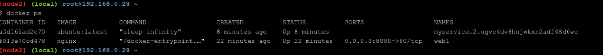

# Docker Networking

## Section #1 - Networking Basics

1. Perintah *```docker network```* adalah perintah utama untuk mengonfigurasi dan mengelola jaringan kontainer.

<div align="center"></div>

2. Jalankan perintah *```docker network ls```* untuk melihat jaringan kontainer yang ada di host Docker saat ini, output tersebut menunjukkan jaringan kontainer yang dibuat sebagai bagian dari instalasi standar Docker

<div align="center"></div>

3.  Untuk melihat rincian konfigurasi jaringan bridge yang meliputi : nama, ID, driver, driver IPAM, info subnet, wadah terhubung, dan banyak lagi dengan mengetikkan perintah *```docker network inspect bridge```*
<div align="center"></div>
<div align="center"></div>

4. Perintah *```docker info```* untuk menunjukkan banyak informasi tentang instalasi docker dan melihat daftar plugin 
<div align="center"></div>

---------------------------------------------------------------

## Section #2 - Bridge Networking

1. Setiap instalasi Docker yang bersih dilengkapi dengan jaringan siap pakai yang disebut bridge. untuk melihatnya ketikan perintah *```docker network ls```*

<div align="center"></div>

2. Pada hasil diatas menunjukkan bahwa jaringan bridge dicakup secara lokal dan jaringan hanya terdapat pada host docker ini
Untuk membuat bridge Linux di host docker dapat menggunakan perintah *```apk update dan apk add bridge```*

<div align="center"></div>
<div align="center"></div>

3. Untuk melihat list bridge pada docker host dengan perintah *```brctl show```*
<div align="center"></div>

4. Kemudian untuk melihat detail dari **docker0** bridge yaitu dengan perintah *```ip a```*
<div align="center"></div> 


5. Selanjutnya kita akan membuat container baru dengan menjalankan perintah *```docker run -dt ubuntu sleep infinity```*
<div align="center"></div> 

6. Untuk melihat container yang sedang berjalan dengan menggunakan perintah *```docker ps```*
<div align="center"></div> 

7. Lalu kita akan melihat antarmuka yang terhubung pada **docker0** setelah pembuatan container baru
<div align="center"></div> 

8. Pada hasil diatas dapat dilihat bahwa setelah pembuatan container baru maka antarmuka akan terhubung pada **docker0**
Selanjutnya, memeriksa jaringan bridge kembali dengan meengetikkan perintah *```docker network inspect bridge```*
<div align="center"></div> 
<div align="center"></div> 

9. Selanjutnya, melakukan ping pada alamat IP container dengan menjalankan perintah *```ping -c5 172.17.0.2```*
<div align="center"></div> 

10. Lalu memeriksa kembali container yang sedang berjalan
<div align="center"></div> 

11. Selanjutnya, kita menjalankan shell ubuntu dengan menggunakan perintah *```docker exec -it ef66e5db5ce8 /bin/bash```*, Setelah masuk pada shell ubuntu kemudian melakukan instalasi program ping dengan menggunakan perintah *```apt-get update && apt-get install -y iputils-ping```*
<div align="center"></div> 

12. Setelah proses instalasi program ping selesai maka dilanjutkan dengan melakukan PING pada www.github.com dengan menggunakan perintah *```ping -c5 www.github.com```*
<div align="center"></div> 

13. Setelah itu keluar dengan perintah *```exit```* dan menjalankan perintah *```docker stop ef66e5db5ce8```*, untuk menghentikan container yang berjalan
<div align="center"></div> 

14. Selanjutnya, menjalanakan container baru yaitu container NGINX dengan menjalankan perintah *```docker run --name web1 -d -p 8080:80 nginx```*
<div align="center"></div> 

15. Melihat kembali container yang sedang berjalan
<div align="center"></div> 

16. Jika tidak dapat menjalankan sesi menggunakan web browser maka dapat menjalankan perintah *```curl 127.0.0.1:8080```*, maka kita dapat terhubung dari host docker
<div align="center"></div> 

---------------------------------------------------------------

## Section #3 - Overlay Networking

1. Pada bagian akan menginisialisasi Swarm baru, bergabung dengan satu node , dan memverifikasi operasi yang berhasil.
<div align="center"></div> 

2. Kemudian masukan sworm join ke dalam terminal kedua
<div align="center"></div>  

3. Untuk melakukan verifikasi bahwa kedua node adalah bagian dari swarm, dengan menggunakan perintah *```docker node ls```*
<div align="center"></div>  

4. Selanutnya, membuat jaringan Overlay baru yang disebut "overnet" dengan menggunakan perintah *```docker network create -d overlay overnet```* dan melihat bahwa jaringan telah berhasil dibuat atau tidak dengan menggunakan perintah *```docker network ls```*
<div align="center"></div>  
<div align="center"></div> 

5. Lakukan perintah yang sama pada terminal kedua, Perhatikan bahwa jaringan “overnet” tidak muncul dalam daftar. Hal ini karena Docker hanya memperluas jaringan overlay ke host ketika dibutuhkan. Hal ini biasanya terjadi ketika host menjalankan tugas dari layanan yang dibuat di jaringan
<div align="center"></div>

6. Gunakan perintah *```docker network inspect overnet```* untuk melihat informasi lebih rinci tentang jaringan “overnet”. Anda harus menjalankan perintah ini dari terminal pertama
<div align="center"></div>
<div align="center"></div>

7. Sekarang kita telah menginisialisasi Swarm dan overlay, sekarang saatnya membuat layanan yang menggunakan jaringan tersebut.
<div align="center"></div>

8. Verifikasi bahwa layanan telah dibuat dan kedua replika sudah berjalan
<div align="center"></div>

9. Verifikasi bahwa satu task (replika) berjalan di masing-masing dari dua node di Swarm
<div align="center"></div>

10. Untuk memeriksa jaringan overnet, dapat dilihat bahwa jaringan overnet sudah terdapat pada terminal kedua
<div align="center"></div>

11. Untuk mendapatkan informasi lebih rinci tentang jaringan "overnet" dengan menggunakan perintah *```docker network inspect overnet```*
<div align="center"></div>
<div align="center"></div>
<div align="center"></div>

12. Begitu juga dengan terminal pertama
<div align="center"></div>
<div align="center"></div>

13. Perintah *```docker ps```* disini digunakan untuk mendapatkan ID container
<div align="center"></div>

14. Menggunakan perintah *```docker exec -it 1832b2f15b18 /bin/bash```* untuk menampilkan shell dan melakukan instalasi *```iputils-ping```* Setelah itu dilanjutkan dengan melakukan *```ping -c5 10.0.0.3```*, Kemudian mengetikkan perintah *```cat /etc/resolv.conf```* lalu dilanjutkan dengan melakukan ping pada layanan dengan menggunakan perintah *```ping -c5 myservice```* jika sudah selesai keluar dengan *```exit```*
<div align="center"></div>
<div align="center"></div>

15. Periksa konfigurasi  "myservice" dengan perintah *```docker service inspect myservice```* . Mari verifikasi bahwa nilai VIP cocok dengan nilai yang dikembalikan oleh perintah *```ping -c5 myservice```* sebelumnya.
<div align="center"></div>
<div align="center"></div>

16. Yang terakhir yaitu melakukan penghapusan layanan **myservice** dengan menggunakan perintah *```docker service rm myservice```*
<div align="center"></div>
