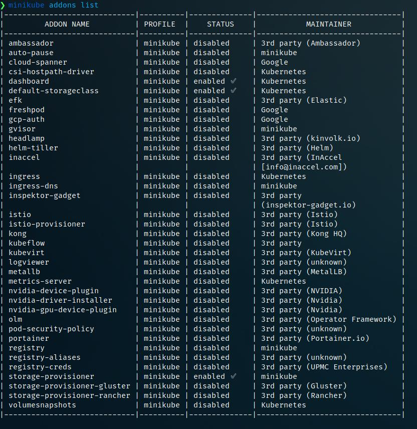

# **Hello Minikube**
This tutorial shows you how to run a sample app on Kubernetes using minikube. The tutorial provides a container image that uses NGINX to echo back all the requests.

# Objectives 
* Deploy a sample application to minikube.
* Run the app.
* View application logs.

# Before you begin 
This tutorial assumes that you have already set up minikube. See minikube [start for]([url](https://minikube.sigs.k8s.io/docs/start/)) installation instructions.
You also need to install kubectl. See [Install tools]([url](https://kubernetes.io/docs/tasks/tools/#kubectl)) for installation instructions.


## Create a minikube cluster
1. Run this command ``` minikube start ```


## Open the Dashboard
1. Open new terminal and run


## Create a Deployment
1. Use the kubectl create command to create a Deployment that manages a Pod. The Pod runs a Container based on the provided Docker image
   


2. View the Deployment
   


3. View the Pod
   


4. View cluster events
   


5. View the kubectl configuration
    


6. View application logs for a container in a pod
   


## Create a Service

1. Expose the Pod to the public internet using the kubectl expose command
   


3. View the Service you created
   


4. Run the following command
   


5. This opens up a browser window that serves your app and shows the app's response


## Enable addons
1. List the currently supported addons
   


2. Enable an addon, for example, ``` metrics-server ```


3. View the Pod and Service you created by installing that addon
   


4. Check the output from ``` metrics-server ```


5. Disable ``` metrics-server ```


## Clean up

1. Now you can clean up the resources you created in your cluster


